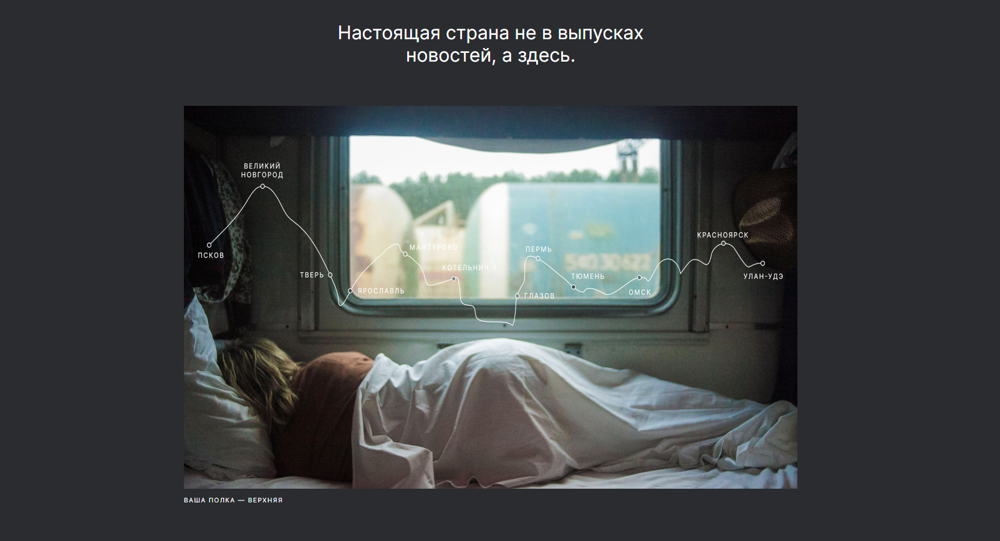

# __Проект: Путешествия по России__

*Проектная работа на курсе по веб-разработке от [Яндекс-практикума](https://practicum.yandex.ru/ "Перейти на сайт практикума")*

## Обзор

Проект адаптивного одностраничного сайта о путешествиях по России, выполненный на основе [макета](https://www.figma.com/file/5S2WSbEFL6awjVWJ0NWL8Q/Sprint-3_-Russia-_-desktop-mobile?node-id=28503%3A0 "Посмотреть макет") в Figma. 
Для реализации проекта были использованы технологии Grid Layout, flexbox, а также применены медиазапросы.

**[Ссылка на сайт](https://sashakostiukova.github.io/russian-travel/)**

## __Связаться со мной__
sashakostiukova@yandex.ru
